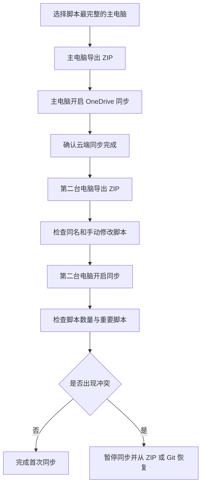

# Tampermonkey 多电脑同步指南

> [!summary] 结论
> Tampermonkey 可以通过 OneDrive、Google Drive、WebDAV 等方式在不同电脑之间同步脚本。
>
> 第二台电脑开启同步后，通常不是简单地“云端覆盖本地”，而是进行合并同步；同一脚本发生冲突时，通常以修改时间较新的版本为准。
>
> 第一次同步前，应先在两台电脑分别导出 ZIP 备份。

---

## 适用场景

适合以下情况：

- 公司电脑和个人电脑都安装了 Tampermonkey
- 两台电脑使用不同浏览器，例如 Chrome 和 Edge
- 希望同步已安装的油猴脚本
- 希望同步自己修改或编写的脚本
- 不希望手动逐个导入脚本

---

## 推荐同步方案

### 首选：OneDrive

推荐优先使用 OneDrive，原因如下：

- Chrome 和 Edge 之间也可以使用
- 不依赖两台电脑登录同一个浏览器账号
- 可以同步自己编写或修改的脚本
- 比浏览器自带同步更适合大量脚本
- 已经使用 OneDrive 时，不需要新增其他云盘

推荐顺序：

1. OneDrive
2. Google Drive
3. WebDAV
4. 浏览器同步

> [!warning] 不推荐优先使用浏览器同步
> 浏览器同步通常依赖 Chrome 或 Edge 自己的账号体系，并可能受到同步容量、脚本来源和跨浏览器兼容性的限制。
>
> 对于自己编写的本地脚本，浏览器同步通常不如 OneDrive 稳定。

---

## 第一台电脑：建立云端基准

应先选择脚本最完整、配置最正确的一台电脑作为主电脑。

### 操作步骤

1. 点击浏览器工具栏中的 Tampermonkey 图标。
2. 打开 **管理面板**。
3. 进入 **设置**。
4. 将配置模式切换为 **高级**。
5. 找到 **脚本同步**。
6. 同步类型选择 **OneDrive**。
7. 登录并授权 Microsoft 账号。
8. 开启脚本同步。
9. 手动执行一次同步。
10. 确认同步状态没有报错。

### 开启同步前备份

进入：

`Tampermonkey 管理面板 → 实用工具 → 导出 ZIP`

建议导出：

- 已安装脚本
- 脚本源代码
- 脚本相关设置
- 脚本存储数据（如果导出界面提供该选项）

备份文件建议命名：

```text
tampermonkey-main-2026-07-19.zip
```

---

## 第二台电脑开启同步会发生什么

第二台电脑开启同步时，通常会将：

- 云端已有脚本
- 第二台电脑本地已有脚本

进行合并处理，而不是直接把第二台电脑全部清空。

### 情况一：本地存在云端没有的脚本

通常会：

- 保留本地脚本
- 将本地脚本上传到同步空间
- 出现在其他已同步设备上

但第一次同步前仍然建议备份，以防版本或删除记录产生冲突。

### 情况二：云端存在、本地不存在

通常会：

- 将云端脚本下载到第二台电脑
- 自动出现在 Tampermonkey 管理面板中

### 情况三：两边存在同一个脚本，代码不同

这是风险最高的情况。

Tampermonkey 通常会根据脚本标识和修改时间判断版本，修改时间较新的版本可能覆盖较旧版本。

同一脚本一般通过以下信息识别：

```javascript
// @name
// @namespace
```

也可能结合脚本内部 ID 或同步记录判断。

> [!danger] 典型风险
> 第一台电脑上的脚本代码是正确版本，但第二台电脑上的同名脚本修改时间更晚。
>
> 第二台电脑开启同步后，较新的本地版本可能上传到云端，并进一步覆盖第一台电脑上的正确版本。

---

## 第二台电脑的安全操作顺序

### 1. 先备份第二台电脑

进入：

`Tampermonkey 管理面板 → 实用工具 → 导出 ZIP`

建议命名：

```text
tampermonkey-second-pc-before-sync-2026-07-19.zip
```

### 2. 检查是否存在同名脚本

重点检查：

- `@name` 相同
- `@namespace` 相同
- 自己手动修改过的脚本
- 自己编写但没有发布地址的脚本
- 公司电脑和个人电脑分别修改过的脚本

### 3. 暂停脚本修改

第一次同步期间：

- 不要同时在两台电脑修改同一个脚本
- 不要同时删除同一个脚本
- 不要同时执行脚本更新
- 不要频繁开启和关闭同步

### 4. 第二台电脑开启 OneDrive 同步

使用和第一台电脑相同的 Microsoft 账号。

### 5. 同步后立即检查

重点检查：

- 脚本数量是否正常
- 重要脚本是否存在
- 脚本启用状态是否正确
- 自定义修改是否保留
- 是否出现重复脚本
- 是否有脚本被意外降级
- 是否有脚本变成旧版本

---

## 哪些内容通常可以同步

Tampermonkey 的脚本同步通常主要处理：

- 已安装脚本列表
- 脚本源代码
- 脚本新增、修改和删除记录
- 脚本启用或禁用状态
- 部分脚本元数据
- 部分脚本设置

---

## 哪些内容不一定同步

不要把脚本同步理解成整套浏览器环境同步。

以下内容通常不会完整同步，或者需要脚本本身支持：

- 网站登录状态
- Cookie
- 网站 localStorage
- IndexedDB
- 浏览器缓存
- 浏览器扩展权限
- 网站弹窗授权
- 下载目录权限
- 跨域访问授权
- 脚本使用的账号密码
- API Key
- Token
- Base URL
- 黑名单和白名单
- 脚本自定义界面中的参数

### `GM_setValue` 数据

很多脚本通过以下 API 保存自己的运行数据：

```javascript
GM_setValue("key", value);
GM_getValue("key");
```

这些数据通常属于当前浏览器中的脚本存储，不应默认认为会随脚本代码一起同步。

因此可能出现：

- 脚本代码已经同步成功
- 第二台电脑也已经安装脚本
- 但脚本内部配置仍然为空
- 需要重新填写 API Key、规则或账号

> [!tip] 判断方法
> 如果脚本提供“导出配置”“导入配置”“云同步”功能，应优先使用脚本自身的配置导出或同步功能。
>
> Tampermonkey 负责同步脚本，脚本自己的数据最好由脚本自身负责。

---

## 推荐的长期维护方案

### 第一层：Tampermonkey 云同步

用途：

- 自动同步脚本安装状态
- 日常在多台电脑之间使用
- 减少重复安装

### 第二层：ZIP 定期备份

建议在以下操作前备份：

- 第一次启用同步
- 更换同步服务
- 大量删除脚本
- 修改多个脚本
- 重装浏览器
- 重装系统
- 更换电脑

建议每月保存一次：

```text
Tampermonkey-Backup/
├── 2026-07/
│   ├── home-pc.zip
│   └── company-pc.zip
└── 2026-08/
```

### 第三层：GitHub 私有仓库

对于自己编写或深度修改的脚本，建议单独放入 GitHub 私有仓库。

目录示例：

```text
tampermonkey-scripts/
├── README.md
├── scripts/
│   ├── github-helper.user.js
│   ├── forum-enhancer.user.js
│   └── internal-tools.user.js
├── docs/
│   └── configuration.md
└── backups/
```

这样可以获得：

- 版本历史
- 修改对比
- 回滚能力
- 多电脑同步
- 防止云同步误覆盖

---

## 冲突处理

发现脚本被错误覆盖时：

1. 立即暂停两台电脑的 Tampermonkey 同步。
2. 不要继续修改被覆盖的脚本。
3. 从之前导出的 ZIP 中恢复脚本。
4. 或从 GitHub 私有仓库恢复正确版本。
5. 删除云端错误版本前，再次确认备份存在。
6. 只在一台电脑上修改并保存正确版本。
7. 确认修改时间更新后，再重新开启同步。
8. 等第一台电脑上传完成后，再开启第二台电脑。

---

## 最稳妥的首次迁移流程



---

## 检查清单

### 首次同步前

- [ ] 已确定哪台电脑是主电脑
- [ ] 主电脑已经导出 ZIP
- [ ] 第二台电脑已经导出 ZIP
- [ ] 已检查两台电脑是否有同名脚本
- [ ] 已检查是否有自己手动修改的脚本
- [ ] 已记录重要脚本中的 API Key 和配置
- [ ] 第一次同步期间不会同时修改脚本

### 同步后

- [ ] 脚本数量正确
- [ ] 重要脚本仍然存在
- [ ] 自定义代码没有被覆盖
- [ ] 启用状态正确
- [ ] 没有出现重复脚本
- [ ] 脚本内部配置仍然可用
- [ ] API Key 和 Token 没有丢失
- [ ] 网站权限已经重新授权

---

## 推荐结论

对于个人电脑和公司电脑同时使用 Tampermonkey 的情况，推荐采用：

```text
OneDrive 同步脚本
        +
Tampermonkey ZIP 定期备份
        +
GitHub 私有仓库保存重要源码
```

其中：

- OneDrive 解决日常同步
- ZIP 解决完整恢复
- GitHub 解决版本管理和误覆盖

> [!important] 核心原则
> Tampermonkey 同步不是严格的“主电脑单向覆盖副电脑”。
>
> 第二台电脑上的较新脚本也可能上传到云端，因此第一次同步前必须备份，并尽量避免两台电脑同时修改同一个脚本。

---

## 相关链接

- [Tampermonkey 官网](https://www.tampermonkey.net/)
- [Tampermonkey FAQ](https://www.tampermonkey.net/faq.php)
- [Tampermonkey 更新记录](https://www.tampermonkey.net/changelog.php)
