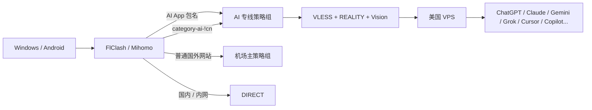

# 用一台美国 VPS 搭建 AI 专用出口：Xray REALITY + FlClash + Mihomo 动态 AI 分流

> [!abstract] 这篇教程解决什么问题
> 用一台 Debian VPS 自建 **VLESS + REALITY + Vision** 出口，并在 Windows / Android 的 **FlClash（Mihomo）** 中做精细分流：
>
> - ChatGPT / Claude / Gemini / Grok 以及 Cursor、Copilot、Perplexity、OpenRouter 等海外 AI 服务走固定 VPS；
> - 普通网站继续走原来的机场/代理；
> - Android 上用 App 包名兜底，避免 ChatGPT、Claude、Gemini、Grok 的 Sentry、Datadog、NTP 等辅助请求漏到其他出口；
> - 使用社区维护的 `category-ai-!cn` 动态规则集，减少手工维护几十个域名；
> - VPS 仍保留为“机场故障时的手动应急出口”，但不参加机场自动测速组。
>
> 本文是**已实际跑通过的阶段性方案**整理版。为了可以公开发布，所有真实 IP、SSH 端口、UUID、REALITY 私钥/公钥、Short ID、机场节点名、订阅地址等均已替换为占位符。

---

## 0. 先看最终架构



核心思想不是“全局都走 VPS”，而是：

```text
AI / AI 编程工具
        ↓
固定 VPS 出口

普通外网
        ↓
机场

国内 / 内网
        ↓
DIRECT
```

这样做的好处是：需要固定出口的 AI 服务尽量保持一致，而视频、下载、GitHub Release、普通网页等流量不会无意义占用 VPS 带宽。

---

## 1. 隐私与安全：公开教程前一定先做脱敏

下面这些内容**绝对不要发布到 GitHub、论坛、博客、截图或群聊**：

| 内容 | 是否可公开 |
|---|---|
| VPS 厂商、套餐名称 | 一般可以 |
| 操作系统、CPU、内存 | 可以 |
| VPS 真实公网 IP | 建议隐藏 |
| SSH 真实端口 | 建议隐藏 |
| VLESS UUID | 不公开 |
| REALITY `privateKey` | **绝对不公开** |
| REALITY 客户端公钥 / `public-key` | 不建议公开 |
| `short-id` | 不建议公开 |
| VLESS 分享链接 / 二维码 | **等同访问凭据，不公开** |
| 机场订阅地址 | **绝对不公开** |
| 机场节点名、套餐信息 | 没必要公开 |
| API Key / Cookie / Token | **绝对不公开** |

本文统一使用：

```text
REPLACE_VPS_IP
REPLACE_SSH_PORT
REPLACE_UUID
REPLACE_PRIVATE_KEY
REPLACE_CLIENT_PUBLIC_KEY
REPLACE_SHORT_ID
```

> [!warning]
> REALITY 的服务端 `PrivateKey` **只存在 VPS 服务端**。不要放进 FlClash，不要放进二维码，也不要为了求助把它截图发出来。

---

## 2. 环境说明

本文以以下环境为例：

- VPS：美国节点；
- 系统：Debian 12；
- 架构：x86_64 / amd64；
- 内存：1 GB 也可运行；
- Xray：官方安装脚本；
- 协议：VLESS + REALITY + XTLS Vision；
- 公网入口：TCP 443；
- Windows / Android 客户端：FlClash；
- FlClash 核心：Mihomo。

如果你的 VPS 已经跑着 Docker、Nginx、Caddy、面板或其他服务，**不要直接照抄防火墙和 443 配置**，先确认端口没有冲突：

```bash
ss -lntup
```

---

# 第一部分：VPS 基础配置

## 3. 第一次登录后先做盘点

以下命令在 **VPS 的 Bash/SSH 终端**执行：

```bash
cat /etc/os-release
uname -r
uname -m
free -h
df -hT /
swapon --show
ip -br addr
ip route
ss -lntup
timedatectl
```

重点确认：

1. 系统确实是你预期的 Debian；
2. 架构是不是 `x86_64`；
3. 443 是否已被其他程序占用；
4. 当前有没有 Swap；
5. 时间是否正确。

---

## 4. 更新 Debian 与安装基础工具

```bash
apt update
apt upgrade

apt install ca-certificates curl wget nano unzip jq openssl sudo ufw \
  htop mtr-tiny dnsutils iproute2 iputils-ping systemd-timesyncd \
  unattended-upgrades debian-security-support

systemctl enable --now systemd-timesyncd
timedatectl status
```

如果系统升级涉及内核，完成更新后可以安排一次重启：

```bash
reboot
```

重连后确认：

```bash
uname -r
```

---

## 5. 1 GB 小内存 VPS：没有 Swap 时加 1 GB

先检查：

```bash
swapon --show
df -hT /
```

**只有没有 Swap 时才执行**：

```bash
if [ -z "$(swapon --noheadings --show)" ] && \
   [ ! -e /swapfile ] && ! grep -qE '^/swapfile[[:space:]]' /etc/fstab; then

  if fallocate -l 1G /swapfile && \
     chmod 600 /swapfile && \
     mkswap /swapfile && \
     swapon /swapfile; then

    printf '/swapfile none swap sw 0 0\n' >> /etc/fstab
    printf 'vm.swappiness=10\n' > /etc/sysctl.d/90-ai-memory.conf
    sysctl -p /etc/sysctl.d/90-ai-memory.conf
    swapon --show
  else
    echo 'Swap 创建失败，请检查文件系统和剩余空间。'
  fi
else
  echo '检测到已有 Swap 或旧配置，跳过。'
fi
```

这个配置的目的不是让 1 GB VPS 变成 2 GB 内存，而是避免某些瞬时内存峰值直接触发 OOM。

---

## 6. UFW：只开放 SSH 与 Xray 443

> [!danger]
> **先确认 VPS 厂商控制台/VNC/救援入口可用，并确认真实 SSH 端口。**
> 写错 SSH 规则可能把自己锁在服务器外面。

查看当前状态：

```bash
ufw status verbose
ss -lntp
```

将 `REPLACE_SSH_PORT` 换成你自己的 SSH 端口：

```bash
ufw default deny incoming
ufw default allow outgoing

ufw allow REPLACE_SSH_PORT/tcp comment 'SSH management'
ufw allow 443/tcp comment 'Xray REALITY'

ufw enable
ufw status numbered
```

这套方案不需要把本地代理端口、数据库端口或未来的监控面板端口直接暴露到公网。

---

## 7. 限制 systemd 日志体积

小硬盘 VPS 没必要让日志无限增长：

```bash
mkdir -p /etc/systemd/journald.conf.d

cat > /etc/systemd/journald.conf.d/90-ai-vps.conf <<'EOF'
[Journal]
SystemMaxUse=100M
RuntimeMaxUse=50M
MaxRetentionSec=7day
EOF

systemctl restart systemd-journald
journalctl --disk-usage
```

正常运行时，Xray 日志保持 `warning` / `error` 即可。排障时可以临时开 debug，但解决后记得恢复。

---

# 第二部分：安装 Xray + REALITY

## 8. 使用 Xray 官方安装器

不要从不明网盘或“一键整合包”下载安装。

```bash
install -d -m 700 /opt/ai-vps-setup
cd /opt/ai-vps-setup

curl -fL --proto '=https' --tlsv1.2 \
  https://raw.githubusercontent.com/XTLS/Xray-install/main/install-release.sh \
  -o install-xray.sh

less install-xray.sh
sha256sum install-xray.sh
bash install-xray.sh help
```

安装时建议先查看 Xray 官方 Releases，再固定一个你确认过的稳定版本。

示例：

```bash
bash install-xray.sh install --version REPLACE_XRAY_VERSION --without-geodata

/usr/local/bin/xray version
systemctl cat xray
```

本文的显式分流不依赖 Xray 的 geoip/geosite 文件，因此服务端可以不安装 geodata。

---

## 9. 生成 VLESS / REALITY 参数

在 VPS 上执行：

```bash
/usr/local/bin/xray uuid
/usr/local/bin/xray x25519
openssl rand -hex 8
```

你会得到几类信息：

| 参数 | 用途 |
|---|---|
| UUID | 服务端和客户端都要填 |
| PrivateKey | **只放服务端** |
| Password / 旧版显示的 PublicKey | 客户端使用；Mihomo 字段仍叫 `public-key` |
| Short ID | 服务端 `shortIds` 与客户端 `short-id` 对应 |

建议立即存进密码管理器，不要靠聊天记录保存。

---

## 10. REALITY 目标域名不要照抄，必须先测试

REALITY 不是“随便填一个大网站域名”。

官方文档中，`target` 是服务端必填项，`serverNames` 通常应与目标返回证书可接受的 SNI 保持一致。

先测试候选：

```bash
/usr/local/bin/xray tls ping www.bing.com

curl -I --http2 \
  --connect-timeout 10 \
  --max-time 20 \
  https://www.bing.com/

openssl s_client \
  -connect www.bing.com:443 \
  -servername www.bing.com \
  -tls1_3 \
  -alpn h2 \
  </dev/null
```

本文实际排障过程中，某个最初候选在客户端 REALITY 握手阶段表现不稳定，换成经过 VPS 实测正常的 `www.bing.com` 后恢复。因此：

> **不要迷信“网上大家都用的 SNI”。你的 VPS 能稳定握手才是标准。**

如果你选择其他域名：

```text
服务端 target      → 域名:443
服务端 serverNames → 域名
客户端 servername  → 同一个域名
```

---

## 11. Xray 服务端配置模板

编辑：

```bash
nano /usr/local/etc/xray/config.json
```

可使用下面的公开占位模板：

```json
{
  "log": {
    "loglevel": "warning"
  },

  "inbounds": [
    {
      "listen": "0.0.0.0",
      "port": 443,
      "protocol": "vless",

      "settings": {
        "clients": [
          {
            "id": "REPLACE_UUID",
            "flow": "xtls-rprx-vision"
          }
        ],
        "decryption": "none"
      },

      "streamSettings": {
        "network": "raw",
        "security": "reality",

        "realitySettings": {
          "show": false,
          "target": "www.bing.com:443",
          "xver": 0,

          "serverNames": [
            "www.bing.com"
          ],

          "privateKey": "REPLACE_PRIVATE_KEY",

          "shortIds": [
            "REPLACE_SHORT_ID"
          ]
        }
      }
    }
  ],

  "outbounds": [
    {
      "protocol": "freedom",
      "tag": "direct"
    },
    {
      "protocol": "blackhole",
      "tag": "block"
    }
  ]
}
```

检查配置：

```bash
/usr/local/bin/xray run \
  -test \
  -config /usr/local/etc/xray/config.json
```

没有错误后：

```bash
systemctl enable xray
systemctl restart xray

systemctl status xray --no-pager
ss -lntp | grep ':443'
journalctl -u xray -n 50 --no-pager
```

Windows 可以先只验证 TCP 端口：

```powershell
Test-NetConnection REPLACE_VPS_IP -Port 443
```

> TCP 443 能连上只代表“端口通”，不能证明 UUID、REALITY 公钥、Short ID、SNI 都正确。

---

# 第三部分：FlClash 添加 VPS 节点

## 12. 为什么使用 FlClash

FlClash 是基于 Clash.Meta / Mihomo 的多平台客户端，可以在 Windows、Android 等平台使用。

本文不要求你把原机场订阅扔掉，而是：

```text
原机场订阅
   +
自己注入一条 VLESS REALITY 节点
   +
覆写脚本做 AI 分流
```

这样机场更新节点时，不需要手工重新拼一份完整 YAML。

---

## 13. Mihomo / FlClash 的 VLESS REALITY 节点模板

下面这段不是完整配置，而是覆写脚本里要注入的一个节点对象：

```javascript
const VPS_NODE_NAME = "AI-VPS";

const aiVpsProxy = {
  name: VPS_NODE_NAME,

  type: "vless",

  server: "REPLACE_VPS_IP",
  port: 443,

  uuid: "REPLACE_UUID",

  network: "tcp",
  tls: true,
  udp: true,

  "packet-encoding": "xudp",
  flow: "xtls-rprx-vision",

  servername: "www.bing.com",
  "client-fingerprint": "chrome",

  "reality-opts": {
    "public-key": "REPLACE_CLIENT_PUBLIC_KEY",
    "short-id": "REPLACE_SHORT_ID"
  },

  smux: {
    enabled: false
  }
};
```

注意：

- Xray 新版 `x25519` 可能把客户端公钥显示成 `Password`；
- Mihomo 客户端字段仍然叫 `public-key`；
- 这里**永远不会出现**服务端 `PrivateKey`。

---

# 第四部分：AI 动态规则集，而不是手工写几十个域名

## 14. 为什么不用纯手工域名

AI 服务会使用：

- 主站；
- API；
- CDN；
- 登录认证；
- 上传下载；
- 遥测；
- 语音 / WebRTC；
- 云厂商依赖。

例如一个 ChatGPT App 请求不一定全是 `openai.com`，可能还会出现 Sentry、Datadog、LiveKit 等。

如果看到一个域名就手工补一个：

```text
漏一个 → 加一个
再漏一个 → 再加一个
```

维护成本会越来越高。

更好的办法是使用社区持续维护的规则数据，再加少量本地兜底。

---

## 15. 使用 MetaCubeX `category-ai-!cn`

本文选择：

```text
MetaCubeX/meta-rules-dat
geo/geosite/category-ai-!cn.mrs
```

这个分类不仅包含：

- OpenAI / ChatGPT；
- Anthropic / Claude；
- Google DeepMind / Gemini；
- xAI / Grok；

还会包含部分：

- Cursor；
- GitHub Copilot；
- Perplexity；
- OpenRouter；
- JetBrains AI；
- Windsurf；
- Hugging Face；
- Poe；
- Mistral；
- Meta AI；
- 其他海外 AI 服务。

如果你的目标就是“**海外 AI 统一走这台固定 VPS**”，这比只维护四家域名更省心。

如果你只想让 ChatGPT / Claude / Gemini / Grok 四家走 VPS，则应改成四个更窄的独立规则集，而不是直接使用整个 `category-ai-!cn`。

---

# 第五部分：Android App 包名兜底

## 16. 为什么域名规则还不够

Android 上 ChatGPT App 可能访问：

```text
OpenAI 核心域名
Sentry
Datadog
NTP
其他共享基础设施
```

像 `sentry.io`、`gstatic.com` 这种是共享服务，**不能粗暴地把整个根域都塞进 AI 出口**，否则其他 App 也会被误分流。

Mihomo 在 Android 上可以通过 `PROCESS-NAME` 匹配应用包名，因此可以直接做 App 级兜底。

截至本文整理时，四个官方 Android App 包名为：

```yaml
PROCESS-NAME,com.openai.chatgpt,AI专线
PROCESS-NAME,com.anthropic.claude,AI专线
PROCESS-NAME,com.google.android.apps.bard,AI专线
PROCESS-NAME,ai.x.grok,AI专线
```

这样：

```text
ChatGPT App 发出的辅助请求
       ↓
仍然跟随 AI 专线
```

而普通浏览器访问共享 CDN 时，不会因此被全部拖进 AI VPS。

---

# 第六部分：一份适合公开分享的 FlClash 覆写脚本

## 17. 完整通用版

> [!important]
> 这份脚本已经去掉了个人机场节点名、个人订阅域名、真实 IP 和密钥。
>
> 使用前至少修改：
>
> - `MAIN_GROUP_NAME`
> - `REPLACE_VPS_IP`
> - `REPLACE_UUID`
> - `REPLACE_CLIENT_PUBLIC_KEY`
> - `REPLACE_SHORT_ID`

```javascript
function main(config) {
  // ============================================================
  // 0. 按自己的机场修改
  // ============================================================
  const MAIN_GROUP_NAME = "🚀 节点选择";

  const AI_GROUP_NAME = "AI专线";
  const VPS_NODE_NAME = "AI-VPS";

  const VPS_IP = "REPLACE_VPS_IP";

  // ============================================================
  // 1. 自建 VPS 节点
  // ============================================================
  const aiVpsProxy = {
    name: VPS_NODE_NAME,

    type: "vless",
    server: VPS_IP,
    port: 443,

    uuid: "REPLACE_UUID",

    network: "tcp",
    tls: true,
    udp: true,

    "packet-encoding": "xudp",
    flow: "xtls-rprx-vision",

    servername: "www.bing.com",
    "client-fingerprint": "chrome",

    "reality-opts": {
      "public-key": "REPLACE_CLIENT_PUBLIC_KEY",
      "short-id": "REPLACE_SHORT_ID"
    },

    smux: {
      enabled: false
    }
  };

  // ============================================================
  // 2. 注入节点，避免重复
  // ============================================================
  config.proxies = Array.isArray(config.proxies)
    ? config.proxies
    : [];

  config.proxies = config.proxies.filter(
    (proxy) => proxy && proxy.name !== VPS_NODE_NAME
  );

  config.proxies.push(aiVpsProxy);

  // ============================================================
  // 3. AI 动态规则集
  // ============================================================
  config["rule-providers"] =
    config["rule-providers"] || {};

  config["rule-providers"]["AI-Global"] = {
    type: "http",
    behavior: "domain",
    format: "mrs",

    url:
      "https://raw.githubusercontent.com/MetaCubeX/meta-rules-dat/meta/geo/geosite/category-ai-!cn.mrs",

    path:
      "./ruleset/ai-global.mrs",

    interval: 86400,

    // 规则集下载也通过自建 VPS
    proxy: VPS_NODE_NAME
  };

  // ============================================================
  // 4. AI 策略组
  // ============================================================
  config["proxy-groups"] =
    Array.isArray(config["proxy-groups"])
      ? config["proxy-groups"]
      : [];

  const groups = config["proxy-groups"];

  const aiGroup = {
    name: AI_GROUP_NAME,
    type: "select",

    proxies: [
      VPS_NODE_NAME,
      MAIN_GROUP_NAME,
      "DIRECT"
    ]
  };

  const aiGroupIndex = groups.findIndex(
    (group) => group && group.name === AI_GROUP_NAME
  );

  if (aiGroupIndex >= 0) {
    groups[aiGroupIndex] = aiGroup;
  } else {
    groups.unshift(aiGroup);
  }

  // ============================================================
  // 5. 自建 VPS 也加入机场主选择组，作为手动应急出口
  //
  // 注意：这里只放进手动 select 组；
  // 不要把 VPS 放进 url-test 自动测速组。
  // ============================================================
  const mainGroup = groups.find(
    (group) => group && group.name === MAIN_GROUP_NAME
  );

  if (
    mainGroup &&
    Array.isArray(mainGroup.proxies)
  ) {
    mainGroup.proxies =
      mainGroup.proxies.filter(
        (name) => name !== VPS_NODE_NAME
      );

    mainGroup.proxies.splice(
      Math.min(1, mainGroup.proxies.length),
      0,
      VPS_NODE_NAME
    );
  }

  // ============================================================
  // 6. Android 四大 AI App 包名兜底
  // ============================================================
  const androidAiRules = [
    "PROCESS-NAME,com.openai.chatgpt,AI专线",
    "PROCESS-NAME,com.anthropic.claude,AI专线",
    "PROCESS-NAME,com.google.android.apps.bard,AI专线",
    "PROCESS-NAME,ai.x.grok,AI专线"
  ];

  // ============================================================
  // 7. 公共 AI Rule-Set
  // ============================================================
  const aiRuleSetRules = [
    "RULE-SET,AI-Global,AI专线"
  ];

  // ============================================================
  // 8. 最小手工兜底
  // ============================================================
  const manualAiRules = [
    // OpenAI
    "DOMAIN-SUFFIX,openai.com,AI专线",
    "DOMAIN-SUFFIX,chatgpt.com,AI专线",
    "DOMAIN-SUFFIX,oaistatic.com,AI专线",
    "DOMAIN-SUFFIX,oaiusercontent.com,AI专线",

    // Claude
    "DOMAIN-SUFFIX,anthropic.com,AI专线",
    "DOMAIN-SUFFIX,claude.ai,AI专线",
    "DOMAIN-SUFFIX,claude.com,AI专线",

    // Gemini
    "DOMAIN,gemini.google.com,AI专线",
    "DOMAIN,aistudio.google.com,AI专线",
    "DOMAIN-SUFFIX,gemini.google,AI专线",
    "DOMAIN,generativelanguage.googleapis.com,AI专线",

    // Grok / xAI
    "DOMAIN-SUFFIX,grok.com,AI专线",
    "DOMAIN-SUFFIX,x.ai,AI专线",
    "DOMAIN,grok.x.com,AI专线",

    // 用于测试出口
    "DOMAIN,api.ipify.org,AI专线"
  ];

  // ============================================================
  // 9. 防止代理回环
  // ============================================================
  const safetyRules = [
    `IP-CIDR,${VPS_IP}/32,DIRECT,no-resolve`
  ];

  // ============================================================
  // 10. 规则优先级
  //
  // Android App
  // ↓
  // AI Rule-Set
  // ↓
  // 手工兜底
  // ↓
  // 防回环
  // ↓
  // 机场原规则
  // ============================================================
  const existingRules =
    Array.isArray(config.rules)
      ? config.rules
      : [];

  config.rules = [
    ...androidAiRules,
    ...aiRuleSetRules,
    ...manualAiRules,
    ...safetyRules,
    ...existingRules
  ];

  // ============================================================
  // 11. AI 定向 DNS
  //
  // 不推翻机场原 DNS，只增加 AI 域名策略。
  // DNS 查询本身通过 AI-VPS；
  // disable-ipv6=true 只丢弃该 DNS 服务器返回的 AAAA。
  // ============================================================
  config.dns = config.dns || {};

  config.dns["nameserver-policy"] =
    config.dns["nameserver-policy"] || {};

  config.dns["nameserver-policy"]["rule-set:AI-Global"] = [
    "https://1.1.1.1/dns-query#AI-VPS&disable-ipv6=true",
    "https://1.0.0.1/dns-query#AI-VPS&disable-ipv6=true"
  ];

  return config;
}
```

---

## 18. 为什么 AI 规则必须放在 Google / GitHub 等大类规则前

Mihomo 规则是：

```text
从上往下
第一条命中就停止
```

例如 Gemini 使用不少 Google 基础设施。

如果顺序是：

```text
Google 大类 → 机场
Gemini → AI VPS
```

某些 Gemini 请求可能在还没轮到 Gemini 规则时，就已经被 Google 大类规则抢走了。

因此应该是：

```text
Android AI App
↓
AI Rule-Set
↓
AI 手工兜底
↓
Google / GitHub / YouTube
↓
机场其他规则
```

---

# 第七部分：DNS 分流

## 19. 为什么只给 AI 增加 DNS Policy，而不是重写整个机场 DNS

DNS 的职责是：

```text
域名 → 找到目标 IP
```

代理规则的职责是：

```text
这个连接 → 从哪个出口走
```

两者不是同一个东西。

本文的策略是：

```text
AI 域名
  ↓
Cloudflare DoH
  ↓
DNS 请求本身通过 AI-VPS

其他域名
  ↓
继续使用机场原 DNS
```

这样不会为了 AI 分流，把原本已经稳定的整套机场 DNS 全部改掉。

Mihomo 支持：

```yaml
nameserver-policy:
  "rule-set:AI-Global":
    - "https://1.1.1.1/dns-query#AI-VPS&disable-ipv6=true"
```

其中：

- `#AI-VPS`：指定 DoH 连接通过该代理；
- `disable-ipv6=true`：丢弃 AAAA 返回；
- `rule-set:AI-Global`：只作用于这组 AI 域名。

> [!note]
> 这不是“保证不触发 AI 风控”的魔法配置。
> 主要价值是减少解析路径混乱、DNS 污染和不同出口之间不必要的不一致。

---

# 第八部分：为什么 `gstatic.com` 不应该整域强制走 AI VPS

实际观察连接日志时，经常会看到：

```text
t0.gstatic.com
t1.gstatic.com
t2.gstatic.com
```

走了普通机场。

这**不一定是漏流量**。

`gstatic.com` 是 Google 大量产品共用的静态资源/CDN 域。如果写：

```yaml
DOMAIN-SUFFIX,gstatic.com,AI专线
```

那么 Google Search、Maps、Fonts、登录页甚至一些第三方网页引用的资源，也可能被拖进 AI VPS。

更合理的做法是：

- Gemini 明确的 AI 域名 → AI Rule-Set；
- Android Gemini App → 包名兜底；
- 通用 `t0/t1/t2.gstatic.com` → 保持普通 Google 路径。

判断“漏没漏”的标准不是“看到 Google 域名走机场”，而是看：

```text
gemini.google.com
generativelanguage.googleapis.com
gemini.gstatic.com
```

这类明确 AI 请求有没有走错。

---

# 第九部分：如何验证

## 20. 验证 VPS 节点本身

Windows PowerShell：

```powershell
curl.exe -x http://127.0.0.1:REPLACE_MIXED_PORT `
  https://api.ipify.org `
  --max-time 20
```

如果 `api.ipify.org` 被规则固定到 `AI专线`，返回值应该是你的 VPS 出口 IP。

---

## 21. 验证动态 AI Rule-Set 是否真的加载

不要只看“预览配置里有 `AI-Global`”。

找一个**没有写在手工兜底里、但属于公共 AI 规则集**的网站，例如 Cursor：

```powershell
curl.exe -I `
  -x http://127.0.0.1:REPLACE_MIXED_PORT `
  https://cursor.com `
  --max-time 20
```

然后打开 FlClash：

```text
请求 / Connections
```

搜索：

```text
cursor.com
```

如果链路显示类似：

```text
cursor.com
→ AI专线
→ AI-VPS
```

就能说明：

```text
AI-Global Rule-Set
已经被实际命中
```

比“文件好像下载了”更有意义。

---

## 22. Android 验证 App 包名兜底

打开 ChatGPT App，发送一条消息后查看 FlClash 请求。

正常情况下，即使看到：

```text
sentry.io
Datadog
NTP
其他辅助请求
```

只要进程/包名显示：

```text
com.openai.chatgpt
```

它也应该命中：

```text
AI专线 → AI-VPS
```

同理可以验证：

```text
com.anthropic.claude
com.google.android.apps.bard
ai.x.grok
```

---

# 第十部分：机场与自建 VPS 怎么配合

## 23. 不要把自建 VPS 放进自动测速组

推荐：

```text
机场自动选择
├─ 机场节点 A
├─ 机场节点 B
└─ ...
```

而：

```text
AI-VPS
```

不要加入 `url-test`。

否则自动测速可能因为某次抖动，把你的固定 AI 出口切掉。

---

## 24. 但可以把 VPS 放进机场主选择组当应急出口

推荐结构：

```text
🚀 节点选择
├─ 自动选择
├─ AI-VPS       ← 手动应急
├─ 节点 A
├─ 节点 B
└─ ...
```

正常：

```text
普通外网 → 机场
AI → AI-VPS
```

机场整体故障时：

```text
手动把主组切到 AI-VPS
```

普通代理流量也能临时从 VPS 出去。

---

## 25. 普通网站走 VPS 会不会“弄脏 IP”

普通浏览：

```text
Google
GitHub
论坛
正常网页
少量下载
```

不会因为经过 VPS 就自动让 IP “变脏”。

真正应该避免的是：

- 公开代理；
- 大量陌生人共享；
- 批量注册；
- 垃圾邮件；
- 爬虫/扫描；
- BT/P2P；
- 攻击流量；
- 大量异常自动化；
- 长期大带宽下载/视频把 AI 流量挤满。

所以比较合理的定位是：

> **AI 专用出口 + 全局应急出口**

而不是“这台 VPS 只能访问 AI”。

---

# 第十一部分：延迟怎么看

## 26. 偶尔 800 ms 不代表节点一定坏了

如果大多数时间：

```text
约 200 ms 左右
```

偶尔某次测速：

```text
500 / 800 ms
```

随后又恢复，通常只是短时抖动。

客户端显示的“延迟”往往不只是 ICMP Ping，还可能包含：

- TCP 建连；
- TLS / REALITY 握手；
- 测试 URL；
- 当时的国际线路拥塞；
- 本地 Wi-Fi / 蜂窝抖动。

对 AI 长连接来说，更值得关注：

```text
持续高延迟
频繁 Timeout
丢包
连接重置
长回答中断
```

而不是单次延迟数字。

---

# 第十二部分：常见错误

## 27. REALITY 节点测试失败

先按层排查：

```text
1. VPS TCP 443 是否可达
2. Xray 是否监听 443
3. UUID 是否一致
4. PrivateKey / public-key 是否混淆
5. short-id 是否一致
6. serverName 是否与服务端 serverNames 对应
7. REALITY target 从 VPS 是否真的稳定
8. 客户端版本是否支持当前字段
```

查看 Xray：

```bash
systemctl status xray --no-pager
journalctl -u xray -n 100 --no-pager
```

不要一遇到失败就：

```text
重装系统
关闭 TLS 校验
乱换十几个协议
同时开 Mux / WARP / CDN / 多级代理
```

一次只改一个变量。

---

## 28. AI 有些请求仍走机场

先判断它到底属于：

```text
AI 核心请求
还是共享基础服务
```

例如：

```text
gstatic.com
sentry.io
pool.ntp.org
```

都可能被很多非 AI App 使用。

Android 优先使用：

```text
PROCESS-NAME
```

做 App 级兜底，不要为了一个 App 把整个公共域名全部强制代理。

---

## 29. 配置更新后突然不工作

检查：

```text
FlClash 最终预览配置
AI-Global provider
AI专线策略组选中项
机场订阅是否改了主策略组名称
Mihomo / FlClash 是否升级
公共规则集是否可下载
```

覆写脚本依赖 `MAIN_GROUP_NAME`。如果机场把：

```text
🚀 节点选择
```

改了名字，你也要同步改脚本变量。

---

# 第十三部分：本文当前还没有做的内容

这份教程只整理**已经跑通的部分**。

下面两块将在后续继续：

- [ ] SSH 密钥登录 + 普通 sudo 用户
- [ ] 验证成功后再考虑关闭 root/password 远程登录
- [ ] Komari Server 私有面板
- [ ] Komari Agent
- [ ] 国内三网延迟曲线
- [ ] 最终重启后自动恢复验收
- [ ] 配置备份与恢复演练

> [!warning]
> SSH 密钥没有验证成功之前，**不要直接关闭 PasswordAuthentication 或 PermitRootLogin**，否则可能把自己锁在服务器外面。

---

# 第十四部分：参考资料

## 30. 官方资料

### Xray / REALITY

- Xray 官方安装器  
  https://github.com/XTLS/Xray-install

- Xray Core Releases  
  https://github.com/XTLS/Xray-core/releases

- Project X：REALITY 配置说明  
  https://xtls.github.io/en/config/transports/reality.html

- XTLS/REALITY 项目  
  https://github.com/XTLS/REALITY

### Mihomo

- Mihomo VLESS 配置  
  https://wiki.metacubex.one/en/config/proxies/vless/

- Mihomo Rule Providers  
  https://wiki.metacubex.one/en/config/rule-providers/

- Mihomo DNS  
  https://wiki.metacubex.one/en/config/dns/

- Mihomo 项目  
  https://github.com/MetaCubeX/mihomo

### FlClash

- FlClash  
  https://github.com/chen08209/FlClash

---

## 31. AI 规则数据

- MetaCubeX/meta-rules-dat  
  https://github.com/MetaCubeX/meta-rules-dat

- `category-ai-!cn.mrs` 所在分支  
  https://github.com/MetaCubeX/meta-rules-dat/tree/meta/geo/geosite

- v2fly/domain-list-community  
  https://github.com/v2fly/domain-list-community

- v2fly OpenAI 数据  
  https://github.com/v2fly/domain-list-community/blob/master/data/openai

- v2fly Anthropic 数据  
  https://github.com/v2fly/domain-list-community/blob/master/data/anthropic

- v2fly Google DeepMind / Gemini 数据  
  https://github.com/v2fly/domain-list-community/blob/master/data/google-deepmind

- v2fly xAI / Grok 数据  
  https://github.com/v2fly/domain-list-community/blob/master/data/xai

---

## 32. 可作为补充思路的社区项目

> [!caution]
> 社区模板适合参考思路，不建议不检查内容就整份复制。

- blackmatrix7/ios_rule_script  
  https://github.com/blackmatrix7/ios_rule_script

- Accademia/Additional_Rule_For_Clash  
  https://github.com/Accademia/Additional_Rule_For_Clash

- 住宅/AI 分流配置示例：Phlegonlabs/clash-verge-setting  
  https://github.com/Phlegonlabs/clash-verge-setting

---

## 33. Android 官方 App 包名来源

- ChatGPT  
  https://play.google.com/store/apps/details?id=com.openai.chatgpt

- Claude  
  https://play.google.com/store/apps/details?id=com.anthropic.claude

- Google Gemini  
  https://play.google.com/store/apps/details?id=com.google.android.apps.bard

- Grok  
  https://play.google.com/store/apps/details?id=ai.x.grok

---

# 结语

最终目标不是堆尽可能多的“网络优化参数”，而是保持结构简单：

```text
VPS：
Debian
└─ Xray
   └─ VLESS + REALITY + Vision

客户端：
FlClash / Mihomo
├─ Android AI App 包名 → AI 专线
├─ category-ai-!cn → AI 专线
├─ AI 专线 → 自建 VPS
├─ 普通国外流量 → 原机场
└─ 国内 / 内网 → DIRECT
```

出现问题时，也按层定位：

```text
VPS 网络
→ Xray
→ REALITY
→ FlClash 节点
→ Rule-Set
→ DNS
→ 单个 App
```

不要同时修改五六项参数。**一次只改变一个变量，再验证结果。**

---

> [!info] 发布前最后自查
> 搜索整篇文档，确保没有残留：
>
> ```text
> 真实 VPS IP
> 真实 SSH 端口
> UUID
> PrivateKey
> public-key
> short-id
> VLESS 分享链接
> 机场订阅地址
> API Key / Cookie / Token
> ```
>
> 截图也要检查右上角账户名、浏览器书签、订阅 URL、节点 IP、二维码、终端历史命令。
